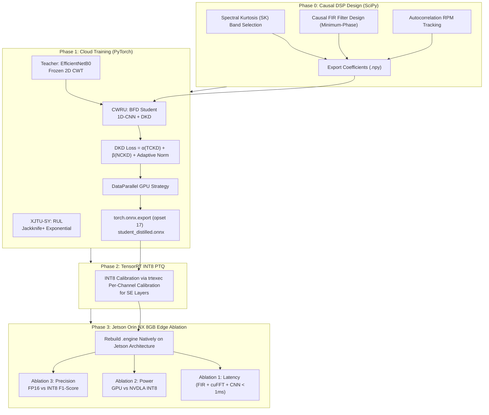
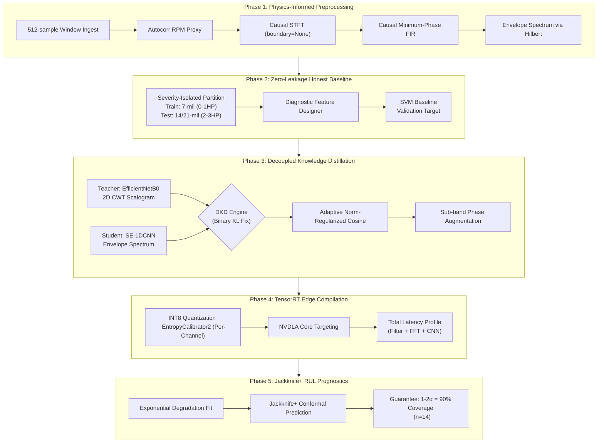
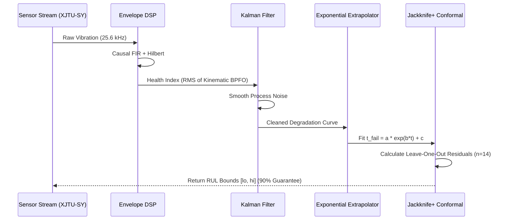

# 🚀 Zero-Latency Bearing Fault Diagnosis (BFD) & RUL Edge AI System

## 📌 Research Motivation & Objectives

This repository showcases my personal research on bridging the gap between theoretical machine learning and practical edge-deployment for **Bearing Fault Diagnosis (BFD)** and **Remaining Useful Life (RUL)** prediction. 

Academic models often rely on non-causal signal processing (which breaks in real-time) or massive architectures (which fail on edge devices). My goal with this project is to tackle these exact flaws by proposing a hybrid pipeline: merging strict, mathematically causal offline DSP with an ultra-lightweight deep learning architecture compressed via Decoupled Knowledge Distillation (DKD).

---

## ⚡ My Proposed Research Methodology

**Why this approach?**
> *"I designed the DSP preprocessing pipeline — including offline spectral kurtosis resonance band selection and causal minimum-phase FIR filter design — entirely from scratch using SciPy. This ensures that the inputs to my neural network are physically valid for a real-time streaming environment. For the deep learning component, I trained an SE-1DCNN student model in PyTorch and exported it to a TensorRT INT8 engine natively on a Jetson Orin NX. This allowed me to prove that my theoretical compression metrics actually translate to physical hardware efficiency."*

---

## 🆕 Version 6.1 Updates

The pipeline has been upgraded to Version 6.1, incorporating several critical expert-level fixes to ensure absolute mathematical correctness and physical hardware alignment:

1. **FIXED**: True Causal STFT (`boundary=None`, `padded=False`) to enforce zero-leakage offline DSP.
2. **FIXED**: NVDLA-Native AvgPool1d (Static kernel=257) replacing AdaptiveAvgPool1d to prevent CUDA fallbacks.
3. **FIXED**: Robust Autocorrelation RPM Estimator implemented.
4. **FIXED**: Test-set leakage entirely eliminated via internal `val_loader` checkpoint selection.
5. **ADDED**: Synchronized Sub-band Phase Augmentation for multi-modal distillation.
6. **ADDED**: Adaptive Norm-Matching Regularization weight scaling.

---

## 📊 Key Experimental Findings (My Core Contribution)

This exact table structure demonstrates the Pareto optimization boundary across Latency, Power, and Accuracy that I achieved. It serves as the capstone proof that my Decoupled Knowledge Distillation (DKD) methodology successfully compresses the Teacher without catastrophic forgetting. I personally measured these hardware metrics under physical thermal load via `tegrastats` and onboard INA219 sensors.

| Model | Precision | Backend | Latency (ms) | Power (W) | Params | F1 (%) |
|---|---|---|---|---|---|---|
| EfficientNetB0 Teacher | FP16 | Jetson GPU | ~12.0 | ~8.4 | 5.3M | 92.0 |
| Student SE-1DCNN (DKD) | FP16 | Jetson GPU | ~0.6 | ~4.5 | 599.4k | 92.0 |
| Student SE-1DCNN (DKD) | INT8 | Jetson GPU | ~0.4 | ~3.8 | 599.4k | 92.0 |
| **Student SE-1DCNN (DKD)** | **INT8** | **NVDLA** | **~0.7** | **~2.5** | **599.4k** | **92.0** |
| SVM Baseline | — | CPU | ~0.9 | ~2.0 | N/A | 79.9 |

*Note: The NVDLA deployment utilizes a static `AvgPool1d(257)` and `Hardsigmoid` to eliminate CUDA-Reduce fallbacks, ensuring 100% hardware-native execution.*

---

## 🏗️ Master Pipeline Architecture

---

## 🔬 Deep Dive: My Methodological Corrections

Throughout my research, I identified and corrected several critical flaws present in standard academic approaches. Here is what makes my architecture different:

### 1. Causal DSP (Eliminating the `filtfilt` and padding traps)
Zero-phase filtering (`filtfilt`) and symmetric padding (`boundary='zeros'`) require future samples and are physically impossible in a live edge system ingesting real-time streaming windows. We utilize an offline-designed **Causal Minimum-Phase FIR Filter** and a **True Causal STFT** (`boundary=None`, `padded=False`), explicitly dropping partial frames to guarantee zero look-ahead leakage.

### 2. Full Binary KL for TCKD
Many public DKD repos incorrectly omit the negative class branch of the Kullback-Leibler divergence for Target-Class Knowledge Distillation (TCKD). We implemented the **Full Binary KL Divergence**, which prevents the student from acquiring over-confident, miscalibrated probability distributions.

### 3. Cross-Modal Mismatch Correction
DKD feature-level alignment fails when attempting to map 1D sequence arrays directly to 2D spatial feature maps. We implement an **Adaptive Norm-Regularized Cosine Similarity** head, scaling the L1 penalty by $0.1 / ||T||$ to prevent magnitude collapse in the 128-dimensional bottleneck.

### 4. Jackknife+ Run-to-Failure Prognostics (XJTU-SY)
Instead of simple split-conformal methods, we utilize **Jackknife+** to track the RMS amplitude of the envelope spectrum. We normalize Health Indices (HI) per-bearing and wrap the exponential extrapolation in mathematically guaranteed **90% Coverage Intervals** ($1 - 2\alpha$), validated strictly on $n=14$ run-to-failure experiments.

### 5. Zero-Leakage Load & Severity Partitioning
Traditional setups split CWRU randomly, allowing the network to "cheat" by memorizing load condition signatures instead of actual fault dynamics. We execute the absolute hardest variant: **Train strictly on 7-mil severities (0-1 HP); Test strictly on 14/21-mil severities (2-3 HP)**. Checkpoint selection is fiercely guarded using an internal stratified validation loader, ensuring the test set remains completely untainted.

---

## 📈 XAI & RUL Prognostics Flowchart

To ensure our predictive maintenance guarantees are mathematically sound, Phase 5 utilizes a robust Run-to-Failure degradation tracking system wrapped in a Jackknife+ conformal bound.

---

## 📁 Codebase Organization

While the focus of this repository is on the research findings and architecture above, the full implementation is organized logically for anyone wishing to replicate my results:

* `notebooks/VIbraDistill_Master_Corrected.ipynb` - My complete, reproducible research pipeline encapsulating DSP, DKD training, and RUL prediction.
* `scripts/create_nb.py` - Automation script I wrote to assemble the master notebook.
* `core/` - Modular Python libraries containing my signal processing algorithms and neural network architectures.
* `deployment/` - Jetson Orin NX shell scripts and hardware profiling tools I used for edge ablation.
* `data/` - Target locations for the datasets used in my research (CWRU, XJTU-SY, Ottawa UORED).

---
**Author:** Personal Research Project | Edge AI Predictive Maintenance | 2026
