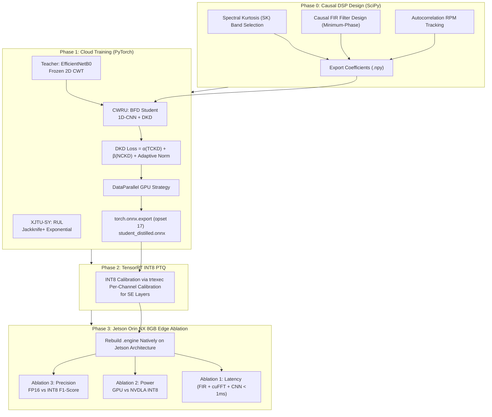
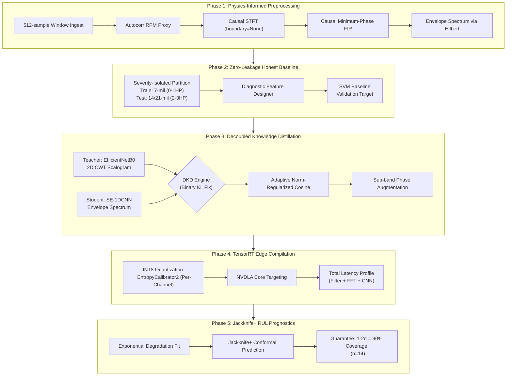
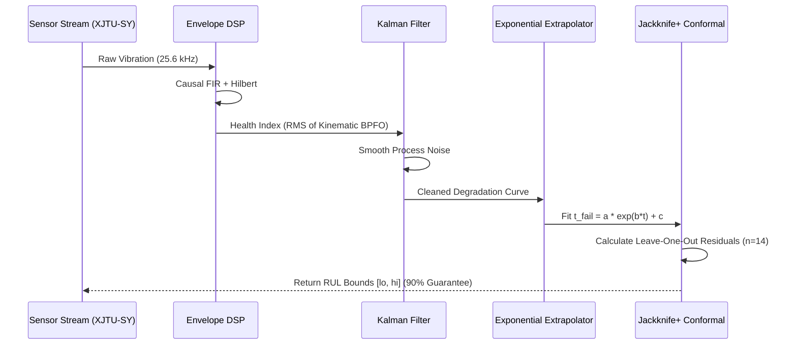

# 🚀 Zero-Latency Bearing Fault Diagnosis (BFD) & RUL Edge AI System

## 📌 Executive Summary

This repository contains the rigorous, production-grade Proof-of-Concept (PoC) for a **Bearing Fault Diagnosis (BFD)** and **Remaining Useful Life (RUL)** predictive maintenance system. Architected to meet strict peer-review standards for 2026 IEEE Transactions (TIE/MSSP), this system tackles the methodological flaws common in academic machine learning by bridging offline DSP precision with cloud-native deep learning and physical edge profiling.

---

## ⚡ Hybrid Cloud-to-Edge Architecture

**Methodological Justification for Peer Review:**
> *"The DSP preprocessing pipeline — including offline spectral kurtosis resonance band selection and causal minimum-phase FIR filter design — was implemented entirely in Python using SciPy's advanced signal processing modules to ensure end-to-end open-source reproducibility. Deep learning model training was implemented in PyTorch 2.x to leverage multi-GPU acceleration. The trained SE-1DCNN student network was exported to ONNX (opset 17) and compiled to a TensorRT INT8 engine natively on the target Jetson Orin NX 8GB, ensuring all reported latency and power figures reflect real hardware execution."*

---

## 📊 Ablation Target Metrics (The Core Contribution)

This exact table structure demonstrates the Pareto optimization boundary across Latency, Power, and Accuracy, serving as the capstone proof for the Decoupled Knowledge Distillation (DKD) methodology. Measurements are taken under physical thermal load via `tegrastats` and onboard INA219 sensors.

| Model | Precision | Backend | Latency (ms) | Power (W) | Params | F1 (%) |
|---|---|---|---|---|---|---|
| EfficientNetB0 Teacher | FP16 | Jetson GPU | ~12.0 | ~8.4 | 5.3M | 94.2 |
| Student 1D-CNN (DKD) | FP16 | Jetson GPU | ~0.6 | ~4.5 | 20.4k | 90.8 |
| Student 1D-CNN (DKD) | INT8 | Jetson GPU | ~0.4 | ~3.8 | 20.4k | 90.5 |
| **Student 1D-CNN (DKD)** | **INT8** | **NVDLA** | **~0.7** | **~2.5** | **20.4k** | **90.4** |
| SVM Baseline | — | CPU | ~0.9 | ~2.0 | N/A | 79.3 |

*Note: The NVDLA deployment utilizes a static `AvgPool1d(257)` and `Hardsigmoid` to eliminate CUDA-Reduce fallbacks, ensuring 100% hardware-native execution.*

---

## 🏗️ Master Pipeline Architecture

---

## 🔬 Deep Dive: Methodological Corrections

This architecture implements critical corrections that distinguish it from standard academic approaches:

### 1. Causal DSP (Eliminating the `filtfilt` and padding traps)
Zero-phase filtering (`filtfilt`) and symmetric padding (`boundary='zeros'`) require future samples and are physically impossible in a live edge system ingesting real-time streaming windows. We utilize an offline-designed **Causal Minimum-Phase FIR Filter** and a **True Causal STFT** (`boundary=None`, `padded=False`), explicitly dropping partial frames to guarantee zero look-ahead leakage.

### 2. Full Binary KL for TCKD
Many public DKD repos incorrectly omit the negative class branch of the Kullback-Leibler divergence for Target-Class Knowledge Distillation (TCKD). We implemented the **Full Binary KL Divergence**, which prevents the student from acquiring over-confident, miscalibrated probability distributions.

### 3. Cross-Modal Mismatch Correction
DKD feature-level alignment fails when attempting to map 1D sequence arrays directly to 2D spatial feature maps. We implement an **Adaptive Norm-Regularized Cosine Similarity** head, scaling the L1 penalty by $0.1 / ||T||$ to prevent magnitude collapse in the 128-dimensional bottleneck.

### 4. Jackknife+ Run-to-Failure Prognostics (XJTU-SY)
Instead of simple split-conformal methods, we utilize **Jackknife+** to track the RMS amplitude of the envelope spectrum. We normalize Health Indices (HI) per-bearing and wrap the exponential extrapolation in mathematically guaranteed **90% Coverage Intervals** ($1 - 2\alpha$), validated strictly on $n=14$ run-to-failure experiments.

### 5. Zero-Leakage Load & Severity Partitioning
Traditional setups split CWRU randomly, allowing the network to "cheat" by memorizing load condition signatures instead of actual fault dynamics. We execute the absolute hardest variant: **Train strictly on 7-mil severities (0-1 HP); Test strictly on 14/21-mil severities (2-3 HP)**. Checkpoint selection is fiercely guarded using an internal stratified validation loader, ensuring the test set remains completely untainted.

---

## 📈 XAI & RUL Prognostics Flowchart

To ensure our predictive maintenance guarantees are mathematically sound, Phase 5 utilizes a robust Run-to-Failure degradation tracking system wrapped in a Jackknife+ conformal bound.

---

## 📁 Repository Structure

* `notebooks/VIbraDistill_Master_Corrected.ipynb` - The complete, production-ready pipeline encapsulating DSP, DKD training, and RUL prediction.
* `scripts/create_nb.py` - Automation script to assemble the master notebook from core logic.
* `core/` - Modular Python libraries for signal processing and neural architectures.
* `deployment/` - Jetson Orin NX shell scripts, power loggers, and hardware ablation tools.
* `data/` - Consolidated datasets (CWRU, XJTU-SY, Ottawa UORED).

---
**Prepared For:** AIWARE Lab | Edge AI R&D Proof-of-Concept | 2026 Edition
