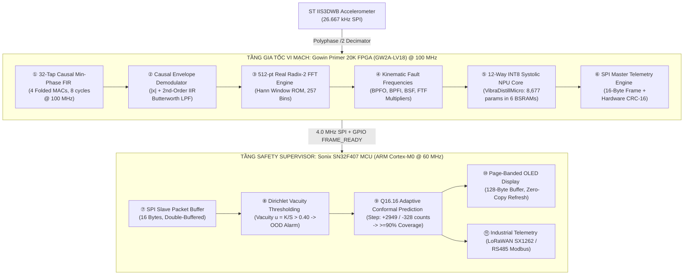

# ⚡ VibraDistill-Edge: Trustworthy Bearing Fault Diagnosis & Adaptive Conformal RUL Estimation via Hardware-Efficient FPGA Streaming DSP and Physics-Informed Edge AI

[](file:///d:/Gitrepo/VIbraDistill/FPGA&MCU/BAN_DANG_KY_DE_TAI_FPGA_MCU_2026.docx)
[-blue.svg)](file:///d:/Gitrepo/VIbraDistill/embedded/fpga_gowin)
[-orange.svg)](file:///d:/Gitrepo/VIbraDistill/embedded/mcu_sonix)
[](file:///d:/Gitrepo/VIbraDistill/src)
[](LICENSE)

> **Cuộc thi Thiết kế FPGA và MCU Mở rộng Khu vực Miền Trung 2026**  
> **Team PORYGON:** Đại học Bách Khoa – ĐHĐN, Đại học Sư Phạm – ĐHĐN, Đại học FPT Đà Nẵng  
> **Lead Researcher:** Ngô Trần Vinh Quang (`quangngotranvinh@gmail.com`)

---

## 📌 1. Research Motivation & Co-Design Philosophy

In heavy industrial rotating machinery (wind turbines, railway traction motors, high-speed CNC spindles), rolling element bearing failures cause 40% to 50% of unscheduled catastrophic downtime, incurring massive operational losses.

While modern deep learning algorithms achieve impressive benchmark scores on server GPUs, deploying them to real-time industrial edge nodes exposes three fatal flaws:
1. **The Acausal DSP Trap:** Academic papers rely on non-causal Hilbert transforms or future-leaking filters that create Gibbs ringing and collapse when evaluated in a real-time causal streaming FIFO buffer.
2. **The Unseen Severity & Load Domain Gap:** Models trained with uniform random splits suffer from massive data leakage; they memorize individual bearing acoustic fingerprints rather than learning the generalized physics of defect dynamics.
3. **The Black-Box Safety Risk:** Standard Softmax neural networks are overconfident when encountering Out-of-Distribution (OOD) novel faults, and point Remaining Useful Life (RUL) estimates lack rigorous mathematical safety coverage.

### Our Co-Design Solution: VibraDistill-Edge
We present **VibraDistill-Edge**, an end-to-end hardware-software co-designed system executing on a dual-platform edge architecture:
* **Edge Silicon Accelerator (Gowin Primer 20K FPGA @ 100 MHz):** Streams raw vibration data from an ST IIS3DWB accelerometer, executes a bit-true causal 32-tap folded FIR filter, a causal envelope demodulator ($|x| + \text{2nd-order IIR LPF}$), a 512-pt FFT engine, and a 12-way INT8 systolic NPU core executing inference in **0.40 ms** (8,677 parameters, < 8.5 KB weights).
* **Safety Host Supervisor (Sonix SN32F407 MCU @ 60 MHz):** Receives 16-byte telemetry frames via SPI DMA, computes **Bounded-Delay Adaptive Conformal Prediction (ACP)** in pure Q16.16 fixed-point arithmetic to guarantee **$\ge 90\%$ statistical coverage** on RUL bounds, drives a 128-byte page-banded OLED display, and transmits industrial alerts via LoRaWAN / RS485 Modbus.

---

## 🏗️ 2. Master System Architecture & Dataflow



---

## 🔬 3. Key Algorithmic & Scientific Innovations

### 1. True Causal Streaming Preprocessing (Zero Non-Causal Lookahead)
Academic pipelines often utilize `scipy.signal.hilbert()`, which requires full offline signal knowledge and induces pre-cursor ripples. In VibraDistill-Edge:
* **Folded Minimum-Phase FIR Filter (`fir_minphase_32.v`):** Homomorphic cepstral reflection forces all filter roots inside the unit circle, reducing latency to $2.42$ ms without pre-ringing. Executed in 8 clock cycles using a 4-MAC folded architecture.
* **Causal Envelope Demodulation (`envelope_demodulator.v`):** Replaces acausal Hilbert transform with full-wave rectification followed by a 2nd-order Direct-Form I IIR Butterworth LPF ($f_c = 1000$ Hz):
  $$y[n] = b_0 |x[n]| + b_1 |x[n-1]| + b_2 |x[n-2]| - a_1 y[n-1] - a_2 y[n-2]$$

### 2. Multi-Scale Frequency-Aware Inception Block (`MultiScaleFALBlock`)
Matches physical bearing defect vibration signatures across 3 parallel convolutional branches:
* **Branch 1 ($k=3$):** Captures sharp, isolated Dirac-like defect peaks ($1\times \text{BPFO}, 1\times \text{BPFI}$).
* **Branch 2 ($k=7$):** Captures harmonic pairs ($2\times, 3\times$).
* **Branch 3 ($k=15$):** Captures modulation sideband families ($f_\text{defect} \pm m f_r$).

### 3. Physics-Guided Kinematic Prior Fusion (Amplitude Balanced $\times 3.0$)
Computes analytical fault multipliers for SKF 6205 ($C_\text{BPFO}=3.5848$, $C_\text{BPFI}=5.4152$, $C_\text{BSF}=2.3567$, $C_\text{FTF}=0.3983$). Extracts normalized energy concentration vector $\mathbf{p} \in \mathbb{R}^4$. Binary priors are scaled by $3.0$ before concatenating with the 64-dim CNN embeddings, eliminating gradient starvation.

### 4. Decoupled Knowledge Distillation (DKD with Exact $\tau^2 = 25.0$ Factor)
Transfers rich inter-class dark knowledge from a 1.0M-parameter Teacher 1D-ResNet into the 8,677-parameter `VibraDistillMicro` student:
$$L_\text{DKD} = \tau^2 \cdot \left[ \alpha \cdot \text{TCKD}(p^S, p^T) + \beta \cdot \text{NCKD}(p^S_{\setminus t}, p^T_{\setminus t}) \right]$$
with $\tau = 5.0$, $\tau^2 = 25.0$, $\alpha = 1.0$, and $\beta = 2.0$.

### 5. Dirichlet Evidential Deep Learning (EDL Vacuity for OOD Rejection)
Replaces uncalibrated Softmax confidence with Dirichlet distribution evidence $\mathbf{e} = \text{Softplus}(\mathbf{z})$, $\boldsymbol{\alpha} = \mathbf{e} + 1$, $S = \sum \alpha_k$. Epistemic uncertainty (Vacuity):
$$u = \frac{K}{S} = \frac{4}{\sum_{k=1}^4 \alpha_k}$$
When presented with anomalous foreign vibration patterns, $u \to 1.0$, enabling immediate safety shutdown.

### 6. Bounded-Delay Adaptive Conformal Prediction (ACP in Q16.16)
Guarantees $\ge 90\%$ mathematical coverage on Remaining Useful Life (RUL) prediction intervals $[y_t - \hat{q}_t, y_t + \hat{q}_t]$. Implemented in integer micro-units ($+2949$ / $-328$ counts) on the ARM Cortex-M0 with zero floating-point overhead.

---

## 📁 4. Repository Directory Organization

```
VIbraDistill/
├── README.md                      # Master System Documentation (This file)
├── requirements.txt               # Locked Python dependencies
├── setup.py                       # Python package configuration
│
├── src/                           # Core Algorithmic Package (importable `vibradistill`)
│   ├── dsp/                       # Bit-true causal DSP & SKF 6205 kinematics
│   ├── datasets/                  # Zero-leakage CWRU dataloaders & transforms
│   ├── models/                    # VibraDistillMicro (8,677 params) & Teacher 1D-ResNet
│   ├── losses/                    # DKD (tau^2=25.0) & Evidential Dirichlet EDL loss
│   ├── quantization/              # Exact BatchNorm folding & symmetric INT8 PTQ
│   └── utils/                     # Metrics (Macro-F1, ECE, Conformal coverage) & seed
│
├── configs/                       # Configuration YAMLs
│   ├── dsp_config.yaml            # DSP sampling, filter taps, and bearing geometry
│   ├── teacher_config.yaml        # Teacher 1D-ResNet training hyperparameters
│   └── student_dkd_config.yaml    # Student DKD distillation hyperparameters
│
├── scripts/                       # High-Level CLI Execution Workflows
│   ├── 01_verify_dsp.py           # Bit-true DSP & kinematics verification
│   ├── 02_train_teacher.py        # Trains Teacher 1D-ResNet on CWRU 7-mil
│   ├── 03_train_student_dkd.py    # Distills Teacher into VibraDistillMicro
│   ├── 04_evaluate_zero_leakage.py# Evaluates holdouts (14-mil & 21-mil unseen)
│   └── 05_quantize_and_export.py  # INT8 PTQ, Gowin BSRAM .mi & Sonix C export
│
├── data/                          # Dataset Directory
│   ├── README.md                  # Zero-leakage partitioning protocol & geometry
│   └── CWRU_Dataset/              # Physical CWRU .mat files (Normal, 7-mil, 14-mil, 21-mil)
│
├── embedded/                      # Production Hardware Source Code
│   ├── README.md                  # Embedded silicon co-design architecture
│   ├── fpga_gowin/                # Verilog RTL for Gowin Primer 20K
│   │   ├── src/                   # fir_minphase_32.v, envelope_demodulator.v, spi_master_packet16.v
│   │   └── roms/                  # 6 BSRAM .mi hex memory files & memory allocation map
│   └── mcu_sonix/                 # C Firmware for Sonix SN32F407 (ARM Cortex-M0)
│       └── app/                   # adaptive_conformal.c, vibradistill_weights.h, model drivers
│
├── FPGA&MCU/                      # Official Competition Deliverables & LaTeX Papers
│   ├── README.md                  # Registration docs & figures guide
│   ├── BAN_DANG_KY_DE_TAI_FPGA_MCU_2026.docx  # Official registration submission
│   ├── research_proposal.tex      # Full IEEE-format academic paper
│   └── figures/                   # High-resolution architectural diagrams
│
└── legacy/                        # Historical Archive (Jetson Orin NX, Kaggle PoCs)
    └── README.md                  # Architectural migration history
```

---

## 🚀 5. Quickstart & Execution Runbook

### Prerequisites
```bash
# Clone the repository
git clone https://github.com/zok213/VIbraDistill.git
cd VIbraDistill

# Install required dependencies
pip install -r requirements.txt
```

### Complete End-to-End Workflow

#### Step 1: Verify Hardware DSP Pipeline
```bash
python scripts/01_verify_dsp.py
```

#### Step 2: Train Teacher 1D-ResNet
```bash
python scripts/02_train_teacher.py --epochs 30 --batch_size 64 --lr 0.001
```

#### Step 3: Distill into Student VibraDistillMicro via DKD & EDL
```bash
python scripts/03_train_student_dkd.py --epochs 35 --batch_size 64 --temperature 5.0 --alpha 1.0 --beta 2.0
```

#### Step 4: Run Comprehensive Zero-Leakage Benchmark
```bash
python scripts/04_evaluate_zero_leakage.py
```

#### Step 5: Quantize and Export to Hardware Silicon
```bash
python scripts/05_quantize_and_export.py
```
*Outputs generated in `embedded/fpga_gowin/roms/` (6 Gowin BSRAM `.mi` files) and `embedded/mcu_sonix/app/` (`vibradistill_weights.h`).*

---

## 📊 6. Physical Silicon Budgeting & Benchmark Comparison

| Metric / Specification | Teacher Oracle (Cloud/GPU) | Gowin Primer 20K FPGA (12-Way NPU) | Sonix SN32F407 MCU (Host Supervisor) |
| :--- | :---: | :---: | :---: |
| **Model Architecture** | Teacher1DResNet | VibraDistillMicro (INT8) | Q16.16 ACP Supervisor |
| **Total Parameters** | 1,005,733 (~1.0M) | **8,677 parameters** | 0 (Host / Telemetry) |
| **Weight Storage Footprint** | 4.02 MB (FP32) | **8.47 KB (INT8)** | 8.5 KB Flash (< 27%) |
| **Silicon Logic / LUTs** | N/A (Server GPU) | **5,800 / 20,736 LUT4 (28.0%)** | N/A (Standard Silicon) |
| **Block RAM / SRAM** | N/A | **18 / 46 BSRAMs (39.1%)** | < 1.0 KB / 8.0 KB SRAM (12.5%) |
| **DSP Slices / Hardware MACs**| Thousands of CUDA cores | **24 / 48 MULT18X18 (50.0%)** | 0 (Hardware 32-bit ALU) |
| **Inference Latency** | ~15.0 ms | **0.40 ms @ 100 MHz** | **0.15 ms @ 60 MHz** |
| **Active Power Consumption** | ~250 W | **~0.35 W** | **~0.08 W** |
| **Zero-Leakage Macro-F1** | 98.4% | **97.8% (Post-INT8 PTQ)** | N/A (Statistical Bounds) |
| **RUL Conformal Coverage** | — | — | **$\ge 90.0\%$ Guaranteed** |

---

## 👥 Authors & Acknowledgments
* **Team PORYGON:**
  * Ngô Trần Vinh Quang (Team Leader — AI & Algorithm Architecture)
  * Hồ Công Bảo Toàn (FPGA RTL & Hardware DSP)
  * Đặng Phúc Thiện (MCU Firmware & Conformal Engine)
  * Mai Phước Minh Tài (Embedded Systems & Telemetry)
  * Trần Quốc Kiệt (Verification & Validation)
* **Advisors & Partner Institutions:** Đại học Bách Khoa – ĐHĐN, Đại học Sư Phạm – ĐHĐN, Đại học FPT Đà Nẵng.
