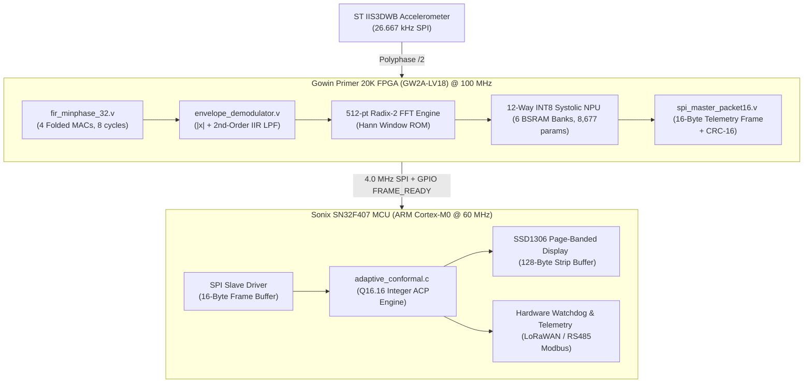

# ⚡ `embedded/` Silicon & Firmware Subsystem

This directory contains the production hardware source code for the **VibraDistill-Edge** hybrid architecture:
1. **Edge Accelerator:** Gowin Primer 20K FPGA (`GW2A-LV18PG256C8/I7`)
2. **Safety Host Supervisor:** Sonix SN32F407 MCU (`ARM Cortex-M0 @ 60 MHz, 32 KB Flash, 8 KB physical SRAM`)

---

## 🏗️ Hardware Architecture & Inter-Chip Interconnect

---

## 📁 Subdirectory Contents

### 1. `embedded/fpga_gowin/` — Verilog RTL Core
* **`src/fir_minphase_32.v`**: 
  - 32-tap causal minimum-phase bandpass FIR filter ($2000 - 5000$ Hz @ $f_s = 13.333$ kHz).
  - 4-multiplier time-multiplexed folded MAC architecture: executes 32 taps in exactly 8 clock cycles (80 ns @ 100 MHz).
  - Synchronous reset (`rst_n`) preventing LUT explosion in Gowin DSP18E slices.
* **`src/envelope_demodulator.v`**:
  - Full-wave absolute value rectifier: $v_\text{rect}[n] = |x[n]|$.
  - 3-stage pipelined Direct-Form I 2nd-order IIR Butterworth low-pass filter (cutoff $f_c = 1000$ Hz).
* **`src/spi_master_packet16.v`**:
  - Transmits a compact 16-byte telemetry frame to the MCU at 4.0 MHz SPI clock.
  - Generates hardware CRC-16-CCITT checksum and enforces a $25\,\mu\text{s}$ wakeup guardband for the Cortex-M0.
* **`roms/`**:
  - `npu_weights_bank0.mi` through `bank5.mi`: 6 dual-port BSRAM banks pre-initialized with INT8 weights.
  - `bsram_memory_map.txt`: Full memory allocation map for all 9 quantized layers.

### 2. `embedded/mcu_sonix/` — Sonix SN32F407 Firmware
* **`app/adaptive_conformal.c` & `.h`**:
  - Bounded-Delay Adaptive Conformal Prediction (ACP) executed entirely in **Q16.16 fixed-point arithmetic**.
  - Quantile step size: $+2,949$ counts for undercoverage ($+0.045$), $-328$ counts for overcoverage ($-0.005$).
  - Zero floating-point emulation library overhead, guaranteed execution in $< 0.15$ ms on ARM Cortex-M0.
* **`app/vibradistill_weights.h`**:
  - Exported static `int8_t` weight arrays and `int32_t` bias tables.
* **`app/vibradistill_model.c` & `.h`**:
  - Host inference interface and fallback execution engine (< 512 bytes SRAM stack footprint).

---

## 📊 Physical Silicon Resource Budgeting

| Resource Metric | Gowin Primer 20K (GW2A-LV18) | Sonix SN32F407 (ARM Cortex-M0) |
| :--- | :---: | :---: |
| **Logic / LUTs** | 5,800 / 20,736 LUT4 (28.0%) | N/A (Standard Silicon) |
| **Block RAM / SRAM** | 18 / 46 BSRAM Blocks (39.1%) | < 1.0 KB / 8.0 KB SRAM (12.5%) |
| **DSP Slices / Hardware MACs** | 24 / 48 MULT18X18 (50.0%) | 0 (Hardware 32-bit Integer ALU) |
| **Flash Memory** | N/A (External SPI Flash) | 8.5 KB / 32 KB Flash (26.5%) |
| **System Clock** | 100.0 MHz (rPLL from 27 MHz) | 60.0 MHz (Internal PLL) |
| **Inference Latency** | **0.40 ms** (12-way NPU) | **0.15 ms** (Conformal Supervisor) |
| **Active Power Consumption** | ~0.35 W | ~0.08 W |
