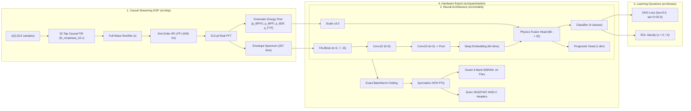

# 🧠 `src/` Core Algorithmic Package Architecture

This directory contains the production-grade, leak-free Python package `vibradistill` designed to bridge high-level PyTorch neural research with physical Gowin Primer 20K FPGA and Sonix SN32F407 MCU execution.

---

## 📐 Mathematical & Architectural Foundations

---

## 📦 Subpackage Directory Structure

### 1. `src/dsp/` — Bit-True Causal Preprocessing
Hardware-faithful DSP engines strictly matching Gowin Verilog RTL:
* **`causal_fir.py`**: 32-tap minimum-phase causal FIR filter using the exact Q1.15 fixed-point coefficients from `fir_minphase_32.v`. Eliminates pre-cursor Gibbs ringing.
* **`envelope.py`**: Causal envelope demodulator ($|x[n]|$ + 2nd-order Direct-Form I IIR Butterworth LPF at $1000$ Hz) matching `envelope_demodulator.v`.
* **`kinematics.py`**: Analytically computes characteristic fault multipliers for the CWRU SKF 6205 bearing ($C_\text{BPFO}=3.5848$, $C_\text{BPFI}=5.4152$, $C_\text{BSF}=2.3567$, $C_\text{FTF}=0.3983$) and extracts the 4-dim normalized energy prior vector $\mathbf{p}$.
* **`pipeline.py`**: Chains FIR $\to$ Rectifier $\to$ IIR $\to$ Hann Window $\to$ 512-pt FFT $\to$ 257-bin spectrum.

### 2. `src/datasets/` — Zero-Leakage DataLoaders
* **`cwru_loader.py`**: Enforces strict Bearing-Wise Partitioning. Training on `Train_7mil` (4 motor loads) + `Normal`, and hold-out evaluation on `Test_Unseen/14mil` and `Test_Unseen/21mil`.
* **`transforms.py`**: Time-domain physical augmentations: AWGN noise injection (SNR 15–30 dB), random cyclic shift, and amplitude scaling.

### 3. `src/models/` — Neural Architectures
* **`student_micro.py` (`VibraDistillMicro`)**: 
  - Exactly **8,677 parameters** (~8.47 KB INT8 weights).
  - Multi-Scale Frequency-Aware Inception Block (`MultiScaleFALBlock`):
    - Branch 1 ($k=3$): Isolated Dirac-like defect peaks ($1\times \text{BPFO}, 1\times \text{BPFI}$).
    - Branch 2 ($k=7$): Harmonic pairs ($2\times, 3\times$).
    - Branch 3 ($k=15$): Modulation sideband families ($f_\text{defect} \pm m f_r$).
  - Physics Fusion: Concatenates 64 CNN deep features with 4-dim kinematic prior scaled by $3.0$ to prevent gradient starvation.
  - Dual Heads: 4-class Evidential Classifier + 1-dim Sigmoid Prognostic RUL Head.
* **`teacher_resnet.py` (`Teacher1DResNet`)**: 
  - High-capacity 1D-ResNet with 4 residual stages (~1.0M parameters). Provides rich soft probability targets for distillation.
* **`npu_emulator.py`**: Bit-accurate software emulator of the Gowin 12-way INT8 MAC systolic core.

### 4. `src/losses/` — Distillation & Uncertainty
* **`dkd_loss.py`**: Decoupled Knowledge Distillation (CVPR 2022). Decouples Target-Class Knowledge Distillation (TCKD) from Non-Target Class Knowledge Distillation (NCKD) with the exact $\tau^2 = 25.0$ gradient scale factor:
  $$L_\text{DKD} = \tau^2 \cdot \left[ \alpha \cdot \text{TCKD}(p^S, p^T) + \beta \cdot \text{NCKD}(p^S_{\setminus t}, p^T_{\setminus t}) \right]$$
* **`edl_loss.py`**: Evidential Deep Learning (NeurIPS 2018). Maps logits $\mathbf{z}$ to non-negative evidence $\mathbf{e} = \text{Softplus}(\mathbf{z})$ and Dirichlet parameters $\boldsymbol{\alpha} = \mathbf{e} + 1$. Computes epistemic uncertainty (Vacuity):
  $$u = \frac{K}{S} = \frac{K}{\sum_{k=1}^K \alpha_k}$$
  Permits real-time Out-of-Distribution (OOD) anomaly rejection on edge hardware without Monte Carlo sampling.

### 5. `src/quantization/` — Silicon Export Engine
* **`bn_fold.py`**: Mathematically exact BatchNorm folding. Absorbs running mean, running variance, gamma, and beta into Conv1D weights and biases:
  $$W' = W \cdot \frac{\gamma}{\sqrt{\sigma^2 + \epsilon}}, \quad b' = (b - \mu) \cdot \frac{\gamma}{\sqrt{\sigma^2 + \epsilon}} + \beta$$
* **`ptq.py`**: Symmetric INT8 quantization with mathematically correct bias scaling: $S_\text{bias} = S_\text{input} \times S_\text{weight}$.
* **`export_gowin.py`**: Generates 6-bank BSRAM memory initialization files (`.mi`) for the Gowin Primer 20K 12-way MAC NPU.
* **`export_c.py`**: Generates ANSI C weight arrays and CMSIS-NN compatible headers for the Sonix SN32F407 MCU.

### 6. `src/utils/` — Metrics & Reproducibility
* **`seed.py`**: Strict deterministic seeding across Python, NumPy, PyTorch, and CUDA.
* **`metrics.py`**: Accuracy, Macro-F1, Confusion Matrix, Expected Calibration Error (ECE), and Conformal Prediction Empirical Coverage rate.
